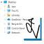

 

# 

#   Javi.ExplorerTreeView

This package provides a Windows Explorer application navigation like usercontrol for WPF. 
The usercontrol inherits from the standard WPF treeview and can be styled like a basic treeview.

- [Features](#features)
- [Getting Started](#getting-started)
- [Usage](#usage)
- [Demo application](#demo-application)
- [License](#license)
- [Acknowledgments](#acknowledgments)

## Features
- Provides a Windows Explorer navigation pane alike treeview usercontrol for WPF
- Targets .NET Full Framework 4
- Supports lazy loading of treeview items
- Dependency property to get the selected folder
- Dependency property to set the root of the treeview
- Dependency property to set if the tree items should be sorted
- Dependency property UnloadItemsOnCollapse to set if the tree items should be unloaded when a branch is collapsed
    
## Getting Started

- Install package using nuget

Install Javi.ExplorerTreeView from NuGet using the Package Manager Console with the following command

    PM> Install-Package Javi.ExplorerTreeView

Alternatively search on [NuGet Javi.ExplorerTreeView](https://www.nuget.org/packages/Javi.ExplorerTreeView)

## Usage

See the [demo application](#demo-application).

## Demo application

A C# WPF [demo application](https://github.com/jacovis/Javi.ExplorerTreeView/tree/master/Demo) is available which 
shows the usage of the ExplorerTreeView control. Code from this demo should not be used in production code, the code is only to 
demonstrate the basic usage of WPF ExplorerTreeView usercontrol.
    
## License

This project is licensed under the [MIT License](https://github.com/jacovis/Javi.ExplorerTreeView/blob/master/LICENSE.md).

## Acknowledgments

Based on https://blog.khmylov.com/2010/11/18/wpf-explorer-treeview-with-selectedpath-binding/  
which inherits from https://www.codeproject.com/Articles/21248/A-Simple-WPF-Explorer-Tree  
see also https://joshsmithonwpf.wordpress.com/2007/11/09/reaction-to-a-simple-wpf-explorer-tree/  
Uses [Dirkster99's](https://www.nuget.org/profiles/Dirkster99) package [Dirkster.WSF](https://www.nuget.org/packages/Dirkster.WSF/)
providing access to the Windows Shell. 
This package is used to interact with the windows shell in order to obtain all special folders. However, the user of 
this ExplorerTreeView usercontrol does need to known anything about or have to interact with Dirkster's package.
